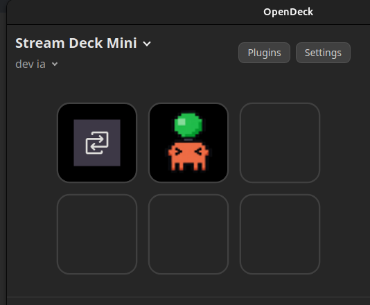
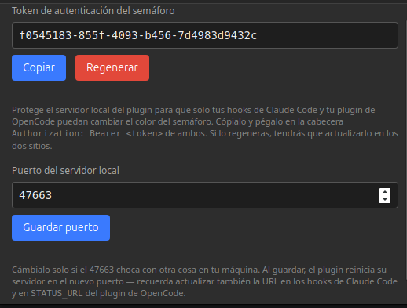

# AI Semaphore — semáforo de estado para Claude Code y OpenCode en OpenDeck

[English](README.md)

<p align="center">
  
  <br>
{  
   
   }
  <br>
</p>

Una sola tecla en tu Stream Deck Mini que combina el estado de **Claude Code**
y **OpenCode**:

- 🔴 **Rojo** — alguno de los dos está esperando tu confirmación/permiso.
- 🟡 **Amarillo** — alguno de los dos está trabajando (ningún rojo activo).
- 🟢 **Verde** — ambos están listos para una tarea nueva.

Prioridad al combinar: **rojo > amarillo > verde** (si uno pide confirmación,
manda el rojo aunque el otro esté trabajando).

Pulsar la tecla muestra 3 segundos el detalle por herramienta (`C:` Claude,
`O:` OpenCode) por si quieres saber cuál de los dos está en ese estado.

## Piezas

```
streamdeck-plugin/   -> el plugin de OpenDeck (la tecla + el servidor de estado local)
claude-code-hooks/   -> hooks para que Claude Code avise al semáforo
opencode-plugin/     -> plugin de OpenCode que avise al semáforo
```

Todo se comunica por HTTP en `127.0.0.1:47663` (configurable). El propio
plugin de OpenDeck es el que levanta ese servidor — no hace falta ningún
proceso adicional corriendo.

## 1. Instalar el plugin de OpenDeck

1. Copia la carpeta `streamdeck-plugin/com.aistatus.opendeck.sdPlugin/`
   (tal cual, con `node_modules/` incluido) a la carpeta de plugins de OpenDeck:

   ```bash
   cp -r streamdeck-plugin/com.aistatus.opendeck.sdPlugin \
     ~/.config/opendeck/plugins/
   ```

   (En Flatpak sería `~/.var/app/me.amankhanna.opendeck/config/opendeck/plugins/`.)

   **En Windows**, copia la carpeta a `%AppData%\opendeck\plugins\` en su
   lugar. El manifest ya incluye `CodePathWin` apuntando a `launch.bat`
   (incluido en la carpeta), que es lo que OpenDeck ejecuta en esa
   plataforma — solo necesitas tener [Node.js 20+](https://nodejs.org)
   instalado y que `node --version` funcione desde una consola cualquiera.
   En Linux y macOS se usa `plugin.js` directamente (vía `CodePath` /
   `CodePathMac`, con su shebang `#!/usr/bin/env node`), no necesitas nada
   adicional ahí.

<p align="center">
  
  <br>
  <em>Así se ve el semáforo en estado verde (listo para nuevas tareas) una vez asignado a una tecla de tu Stream Deck Mini.</em>
</p>
2. Reinicia OpenDeck (o usa `opendeck --reload-plugin com.aistatus.opendeck.sdPlugin`
   si tu versión lo soporta).

<p align="center">
  
  <br>
  <em>Desde el panel de propiedades puedes copiar tu token de seguridad único o modificar el puerto por defecto si tienes algún conflicto.</em>
</p>
3. En la app añade la acción **"Semáforo IA"** a una tecla de tu Stream Deck Mini.

4. Comprueba que el servidor de estado responde:

   ```bash
   curl http://127.0.0.1:47663/status
   # {"claude":0,"opencode":0}   -> 0=verde, 1=amarillo, 2=rojo
   ```

   En Windows (PowerShell): `Invoke-RestMethod http://127.0.0.1:47663/status`

## 2. Copiar el token de autenticación

El servidor local del plugin solo escucha en `127.0.0.1`, pero eso no basta:
cualquier otro proceso de tu máquina (o una pestaña del navegador, que puede
mandar peticiones POST "simples" a `localhost` sin que salte el CORS) podría
mandarle un POST y falsear el semáforo. Por eso las peticiones que cambian
estado exigen un token.

La primera vez que arranca el plugin genera un token aleatorio y lo guarda.
Para verlo:

1. En OpenDeck, haz clic sobre la tecla "Semáforo IA" para abrir su panel de
   configuración (el Property Inspector).
2. Verás el campo **"Token de autenticación del semáforo"** con dos botones:
   **Copiar** y **Regenerar**.
3. Cópialo — lo necesitas en los dos pasos siguientes.

Si alguna vez sospechas que se ha filtrado, pulsa **Regenerar** y actualízalo
en los dos sitios de abajo (el anterior deja de funcionar al instante).

## 3. (Opcional) Cambiar el puerto

Por defecto todo usa el `47663`. Si choca con otra cosa en tu máquina, en el
mismo panel del Property Inspector verás el campo **"Puerto del servidor
local"** con su botón **Guardar puerto** — al guardar, el plugin reinicia su
servidor ahí mismo, sin tener que reiniciar OpenDeck.

Eso sí: los otros dos consumidores (los hooks de Claude y el plugin de
OpenCode) no se enteran solos del cambio. Tienes dos formas de mantenerlos
sincronizados:

- **Manual**: edita el número `47663` a mano en `settings.snippet.json` y en
  `ai-semaphore.ts`.
- **Con variable de entorno**: exporta `AI_SEMAPHORE_PORT=<nuevo_puerto>` en
  el shell desde el que arrancas Claude Code y OpenCode (por ejemplo en tu
  `~/.bashrc`/`~/.zshrc`). Ambos archivos ya la leen si está presente, así
  que no hace falta tocar nada más.

## 4. Conectar Claude Code

Copia el contenido de `claude-code-hooks/settings.snippet.json` dentro del
bloque `"hooks"` de tu `~/.claude/settings.json` (o `.claude/settings.json`
del proyecto), sustituyendo las tres apariciones de `<TU_TOKEN>` por el token
copiado. Si ya tienes hooks configurados, añade `UserPromptSubmit`,
`Notification` y `Stop` como claves hermanas de las que ya tengas, en vez de
sobrescribir el archivo entero.

Qué hace cada uno:
- `UserPromptSubmit` → amarillo, en cuanto le mandas una tarea.
- `Notification` (matcher `permission_prompt`) → rojo, cuando pide permiso.
- `Stop` → verde, cuando termina de responder.

## 5. Conectar OpenCode

Copia `opencode-plugin/ai-semaphore.ts` a:

- `~/.config/opencode/plugins/ai-semaphore.ts` para que aplique a todas tus
  sesiones, o
- `.opencode/plugins/ai-semaphore.ts` dentro de un proyecto concreto.

Dentro del archivo, sustituye `<TU_TOKEN>` por el mismo token, o —más cómodo
si lo regeneras a menudo— deja esa línea tal cual y exporta
`AI_SEMAPHORE_TOKEN` en el entorno desde el que lanzas OpenCode; el plugin lo
usa automáticamente si está presente.

OpenCode carga automáticamente los `.ts`/`.js` de esas carpetas al arrancar,
no hace falta registrarlo en `opencode.json`.

## Notas

- El endpoint `GET /status` (solo lectura, útil para depurar con `curl`) no
  pide token a propósito: lo único que expone es qué color hay en cada
  fuente y el puerto activo, no permite cambiar nada.
- Si quieres saltarte el flujo del Property Inspector (por ejemplo, para
  arrancar OpenDeck desde un script), puedes fijar el token y/o el puerto tú
  mismo con las variables de entorno `AI_SEMAPHORE_TOKEN` y
  `AI_SEMAPHORE_PORT` antes de lanzarlo; el plugin las usa en vez de lo
  guardado en el Property Inspector.
- El `Stop` de Claude Code se dispara cada vez que termina de responder, no
  solo al completar una tarea larga con varias vueltas; para tu caso de uso
  (saber cuándo puedes mandarle algo nuevo) es exactamente lo que hace falta.
